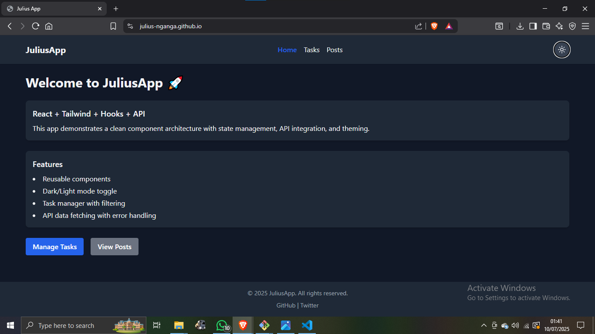

# 🚀 Julius App

A responsive React application built with **Vite**, **Tailwind CSS**, and **React Router**. It demonstrates reusable component architecture, state management with hooks, theme switching (light/dark mode), task management, and API integration with JSONPlaceholder.

---

## 🌐 Live Demo

🔗 [View it Live](https://julius-nganga.github.io/JULIUS-APP/)

---

## 📦 Features

- ✅ Component-based architecture (Button, Card, Navbar, Footer)
- ✅ Task Manager with:
  - Add, complete, delete tasks
  - Filter by All, Active, Completed
  - Persistent with localStorage
- ✅ Theme switcher (light/dark)
- ✅ API integration with JSONPlaceholder:
  - Fetch, display, and search posts
  - Pagination support
- ✅ Responsive design for all screens
- ✅ Custom Tailwind animation utilities

---

## 🛠 Tech Stack

- ⚛️ React 18
- ⚡ Vite
- 🎨 Tailwind CSS 3
- 🌐 React Router DOM
- 💡 Lucide React Icons
- 🔧 pnpm

---

## 📁 Folder Structure

